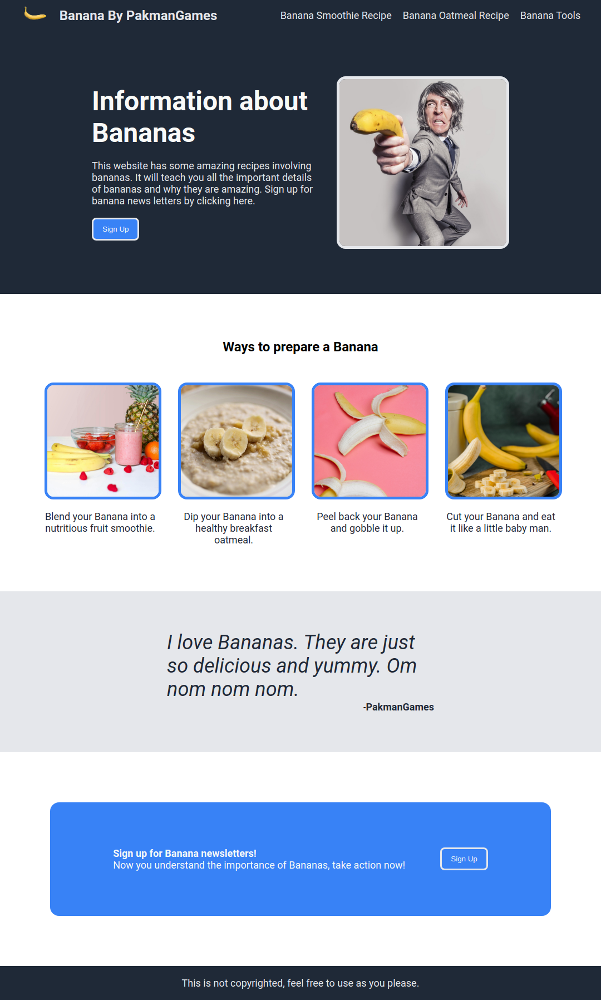

# odin-landing-page
This project utilizes concepts of flexbox and styling, made in pure HTML5 and CSS3 to create a webpage fit for all browsing resolutions.

I was able to apply my newly learned skills in creating a landing-page based on the reference images that can be found in the reference-images directory.

It was a very much enjoyable project that I had fun making and learned concepts beyond what the course had taught, such as styling images, rounded borders, and webpage icons.

Check out the page for yourself! Click [here](https://pakmangames.github.io/odin-landing-page/)!

Preview of the page:

References for images and other links used:

[Banana Logo](https://unsplash.com/photos/yellow-banana-on-white-background-Kl3467edwsE)

[Banana Suit](https://pixabay.com/photos/suit-business-man-banana-business-673697/)

[Banana Newsletters](https://www.bananalink.org.uk/newsletters/)

[Banana Smoothie Recipe](https://www.allrecipes.com/recipe/221261/peanut-butter-banana-smoothie/)

[Banana Oatmeal recipe](https://www.allrecipes.com/recipe/43835/chocolate-banana-oatmeal-porridge/)

[Banana Tools](https://blog.loosco.com/loos-cableware/blog/three-tools-commonly-used-on-banana-plantations)

[Banana Smoothie](https://www.pexels.com/photo/strawberry-smoothie-on-glass-jar-775032/)

[Banana Oatmeal](https://pixabay.com/photos/porridge-banana-baby-food-meal-7951848/)

[Peeled Banana](https://www.pexels.com/photo/mellow-sweet-bananas-on-pink-surface-5945847/)

[Cut Banana](https://unsplash.com/photos/yellow-banana-fruit-on-brown-wooden-chopping-board-R6qyvAySjOU)

That's a lot of banana pictures.
